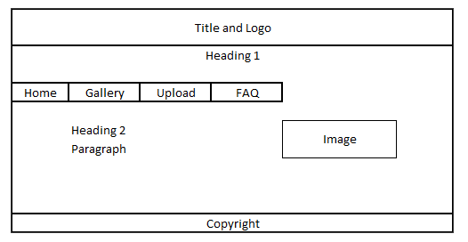
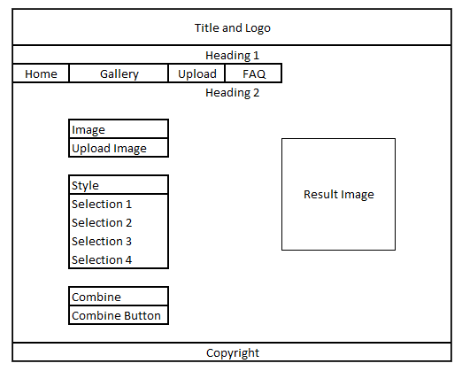
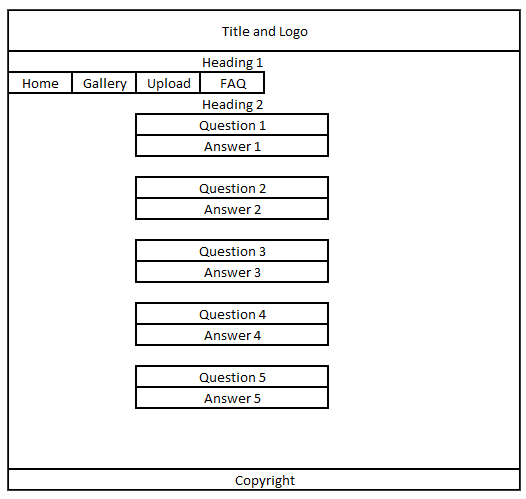

# Somnium DeepDream Art

Context: https://en.wikipedia.org/wiki/DeepDream

Using HTML & CSS, I created this dynamic mockup website to showcase art generated by Google's DeepDream program. DeepDream was what piqued my interest in Artificial Intelligence and Machine Learning, its psychedelic aeshetic that is 'hallucinated' by computers is fascinating beyond words.

Live Preview: https://jordankzf.github.io/somnium-deepdream-art/index.html

## Storyboard

## Testing Results

| No | Test Condition | Expected Result | Actual Results | Remarks |
| --- | --- | --- | --- | --- |
| 1. | Home page button | Directs the navigation to homepage/main page | Performs as expected | Selected page button on navigation bar is highlighted in green. |
| 2. | Gallery page button | Directs the navigation to gallery page | Performs as expected | Same as above. |
| 3. | Upload page button | Directs the navigation to upload page | Performs as expected | Same as above. |
| 4. | FAQ page button | Directs the navigation to FAQ page | Performs as expected | Same as above. |
| 5. | &quot;Choose file&quot;Button in Upload Page | Prompts user to upload an image file | Performs as expected | The user can only select specific file types (example: .jpg, .png, .gif). This behaviour is desired as part of the design. |
| 6. | &quot;Selecting style&quot; radio button | Allows the user to select one of four preset styles. More than one selection should not be possible. | Performs as expected | The selected option&#39;s radio button is checked. |
| 7. | &quot;Show the magic&quot; button in Upload Page | Shows a repainted version of the picture based on the chosen art and style | Shows an animated loading icon that loops forever. No output image is produced. | Upload section is non-functional on purpose, as it was created only to demonstrate the visual design of the website without the need for it to be actually working. |
